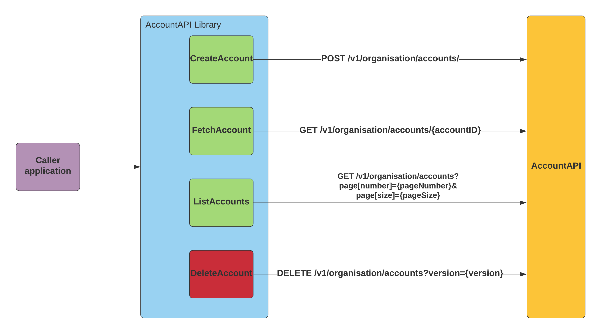

# Zero, One, GO!
-----
# Getting Started - An introduction into setting up your development environment

First lesson will cover basics of GoLang and guide you into setting up your development environment.

## Go Language Specification

Go is a general-purpose language designed with systems programming in mind. (from [GoLang spec](https://golang.org/ref/spec))

It is:
* strongly typed, where types (String, Integer, etc.) need to be defined or (automatically) inferred for attributes and methods
* garbage-collected, so that developers do not need to take care (too) much about memory management
* has explicit support for concurrent programming

Go programs are created from packages, which are building blocks of Go applications. We will deep dive into packages within this tutorial.

## Configuring Development Environment

As this is an opinionated guide, we will use VisualStudio Code within this tutorial.

The complete guide to get started is [in this Youtube Video]((https://www.youtube.com/watch?v=YOUTUBE_VIDEO_ID_HERE))

A quick summary of steps you need to get started:
* Install Git from [project's website](https://git-scm.com/downloads)
* Install Microsoft VisualStudio Code from [project's website](https://code.visualstudio.com/download)
* From VisualStudio Code Extensions menu, install Go Extension `golang.go`
* Clone this project to your home directory with `git clone git@github.com:dexpetkovic/zero-one-go.git`

## What are we actually building?

The goal of this tutorial is to write a client library in Go which will access REST API of a Bank, for the management of bank accounts.

We will first implement our library against mocked Bank API and later on use the real API.

Further to this:
* We will not implement authentication
* Bank accounts will be created, fetched, listed and deleted using this library
* We will use [Bank's API specifications](api-specs.md) which describe the API and it's contract

## Architecture of Account API library

The architecture of the Account API library and the Bank's backend API that we abstract can be at best described with the helicopter view.

  
   

For the caller application, our AccountAPI library will support the following operations on Bank's REST API:
* Create Account
* Fetch single Account
* List all Accounts, with paging support
* Delete Account

To accomplish this functionality we will decouple the account API library into several pieces. 
* The key functionality will be described in [service](../src/accountapi/service.go) and its [tests](../src/accountapi/service_test.go) 
* [Service](../src/accountapi/service.go) will depend on the HTTP [client](../src/accountapi/client.go). The [client](../src/accountapi/client.go) will perform the actual calls towards the actual API backend, mocked in [client tests](../src/accountapi/client_tests.go)
* [Configuration](../src/accountapi/configuration.go) will manage library config
* [Account](../src/accountapi/account.go) will define Account objects that will be sent or received as JSON payload
* [Errors](../src/accountapi/errors.go) will define Error objects that will be sent or received as JSON payload

We will first describe [how to write test cases in details](../writing-tests/README.md) and then build the library components based on test cases - Test Driven Development in action!